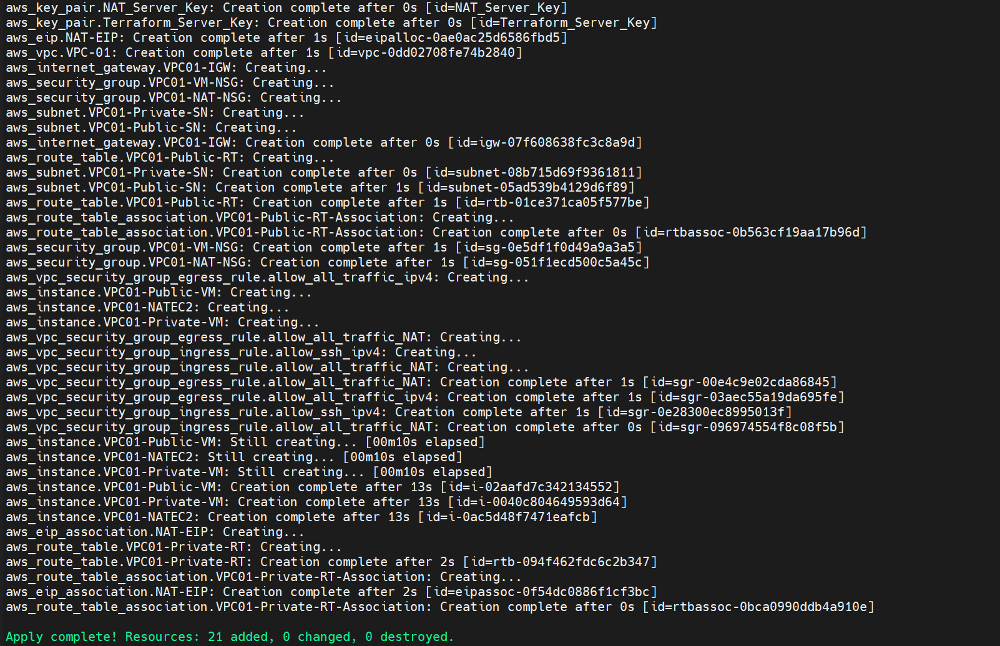
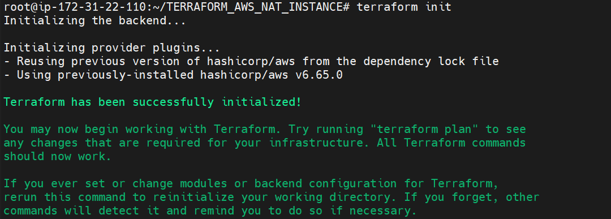
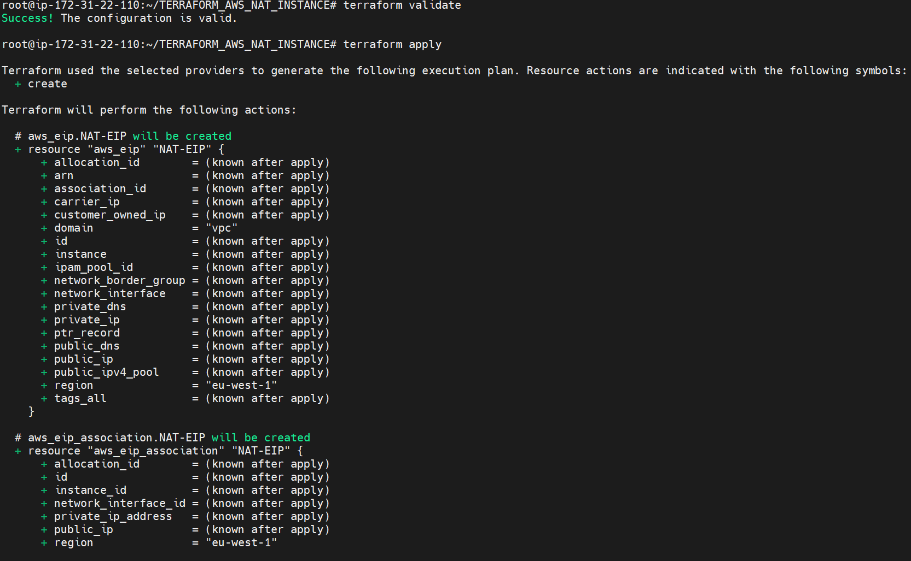
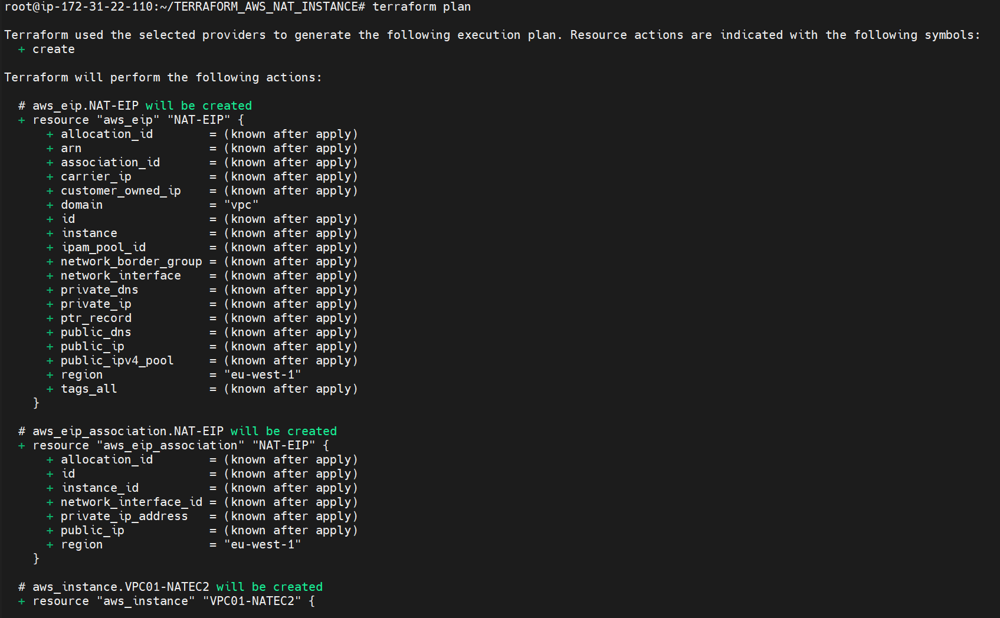

AWS VPC - Public & Private Subnet Architecture with NAT Instance using Terraform

Project Overview

This project demonstrates how to build an AWS Virtual Private Cloud (VPC) infrastructure using Terraform.

The infrastructure includes:

- Custom VPC
- Public Subnet
- Private Subnet
- Internet Gateway
- NAT Instance
- Elastic IP
- Public Route Table
- Private Route Table
- Security Groups
- Public EC2 Instance
- Private EC2 Instance
- AWS Key Pairs
- EC2 User Data Configuration
- IP Forwarding
- IPTables MASQUERADE

The goal is to:

- Allow the Public EC2 instance to access the Internet through the Internet Gateway.
- Allow the Private EC2 instance to access the Internet through the NAT Instance.
- Keep the Private EC2 instance without a public IP address.
- Configure an EC2 instance to work as a NAT Instance.
- Automate the AWS infrastructure using Terraform.

Architecture

The Terraform configuration creates a VPC containing Public and Private Subnets.

The Public Subnet contains:

- NAT Instance
- Public EC2 Instance

The Private Subnet contains:

- Private EC2 Instance

The Public Subnet uses an Internet Gateway for Internet connectivity.

The Private Subnet sends Internet-bound traffic to the NAT Instance through the Private Route Table.

The NAT Instance forwards the traffic to the Internet through the Internet Gateway.

Services Used

- Amazon VPC
- Amazon EC2
- Internet Gateway
- NAT Instance
- Elastic IP
- Route Tables
- Security Groups
- AWS Key Pair
- EC2 User Data
- IPTables
- Terraform
- MobaXterm

Network Details

| Resource | CIDR / Configuration |
|----------|----------------------|
| VPC | 192.168.0.0/16 |
| Public Subnet | 192.168.1.0/24 |
| Private Subnet | 192.168.3.0/24 |
| NAT Instance | t3.micro |
| AWS Region | eu-west-1 |

Terraform Execution Steps

Step 1 - Initialize Terraform

Initialized the Terraform working directory and downloaded the required AWS provider plugins.

terraform init

Step 2 - Validate Terraform Configuration

Validated the Terraform configuration to check for syntax and configuration errors.

terraform validate

Step 3 - Review Terraform Execution Plan

Created a Terraform execution plan to preview the AWS infrastructure that will be created.

terraform plan

Step 4 - Apply Terraform Configuration

Applied the Terraform configuration to provision the AWS infrastructure.

terraform apply

AWS Infrastructure

Step 5 - Create VPC

Created a custom AWS VPC with the CIDR block:

192.168.0.0/16

The VPC acts as the main network for the Public and Private Subnets.

Step 6 - Create Public Subnet

Created the Public Subnet with the CIDR block:

192.168.1.0/24

The NAT Instance and Public EC2 Instance are deployed inside this subnet.

The Public Subnet uses the Internet Gateway for Internet connectivity.

Step 7 - Create Private Subnet

Created the Private Subnet with the CIDR block:

192.168.3.0/24

The Private EC2 Instance is deployed inside this subnet.

The Private EC2 Instance does not have a public IP address.

Internet-bound traffic from the Private Subnet is sent to the NAT Instance.

Step 8 - Create Internet Gateway

Created and attached an Internet Gateway to the VPC.

The Internet Gateway provides Internet connectivity for resources in the Public Subnet.

The NAT Instance uses the Internet Gateway to forward Internet-bound traffic from the Private Subnet.

Step 9 - Configure Public Route Table

Configured a Public Route Table and associated it with the Public Subnet.

| Destination | Target |
|------------|---------|
| 192.168.0.0/16 | local |
| 0.0.0.0/0 | Internet Gateway |

The default route sends Internet-bound traffic from the Public Subnet to the Internet Gateway.

Step 10 - Allocate Elastic IP

Allocated an Elastic IP address for the NAT Instance.

The Elastic IP provides a stable public IPv4 address for the NAT Instance.

The NAT Instance uses this public address when communicating with the Internet.

Step 11 - Create NAT Instance

Created an EC2 instance to function as a NAT Instance.

The NAT Instance is deployed inside the Public Subnet.

Configuration:

| Configuration | Value |
|--------------|-------|
| Instance Type | t3.micro |
| Subnet | Public Subnet |
| Public IP | Enabled through Elastic IP |
| Source/Destination Check | Disabled |

The Source/Destination Check is disabled because the NAT Instance needs to forward traffic that is not directly destined for itself.

Step 12 - Configure NAT Instance using User Data

Configured the NAT Instance using an external shell script.

The Terraform configuration passes the shell script to the EC2 instance using User Data.

Example:

user_data = file("/root/TERRAFORM_AWS_NAT_INSTANCE/nat_config.sh")

The User Data script performs the required NAT configuration during EC2 startup.

The configuration includes:

- Installing IPTables
- Enabling IPTables service
- Enabling IPv4 forwarding
- Configuring MASQUERADE
- Saving IPTables rules

Step 13 - Enable IPv4 Forwarding

Enabled IPv4 packet forwarding on the NAT Instance.

IPv4 forwarding allows the EC2 instance to forward packets received from the Private EC2 toward the Internet.

The forwarding configuration is enabled using:

net.ipv4.ip_forward=1

Step 14 - Configure IPTables MASQUERADE

Configured IPTables MASQUERADE on the NAT Instance.

The MASQUERADE rule changes the source address of outbound traffic from the Private EC2 to the NAT Instance's public address.

This allows the Private EC2 to communicate with the Internet without having its own public IP address.

Step 15 - Configure Private Route Table

Configured a Private Route Table and associated it with the Private Subnet.

| Destination | Target |
|------------|---------|
| 192.168.0.0/16 | local |
| 0.0.0.0/0 | NAT Instance |

The default route sends Internet-bound traffic from the Private Subnet to the NAT Instance.

The NAT Instance then forwards the traffic to the Internet Gateway.

Step 16 - Create Security Groups

Created Security Groups for the EC2 instances using Terraform.

The NAT Security Group allows the required inbound and outbound traffic for the NAT lab configuration.

The EC2 Security Group allows SSH inbound traffic and outbound traffic.

Step 17 - Create AWS Key Pairs

Created AWS Key Pairs using Terraform for EC2 SSH authentication.

The key pairs are used to access the EC2 instances through SSH.

Step 18 - Launch Public EC2 Instance

Launched a Public EC2 instance inside the Public Subnet.

The Public EC2 instance has a public IP address.

The traffic path is:

Public EC2
↓
Public Route Table
↓
Internet Gateway
↓
Internet

Step 19 - Launch Private EC2 Instance

Launched a Private EC2 instance inside the Private Subnet.

The Private EC2 instance does not have a public IP address.

The Private EC2 instance uses the NAT Instance for outbound Internet connectivity.

The traffic path is:

Private EC2
↓
Private Route Table
↓
NAT Instance
↓
Internet Gateway
↓
Internet

Connectivity Testing

Step 20 - Test Public EC2 to Private EC2 Connectivity

Tested connectivity between the Public EC2 instance and the Private EC2 instance using the private IP address.

The Public EC2 can communicate with the Private EC2 through the VPC private network.

Example:

ssh ec2-user@<PRIVATE_EC2_PRIVATE_IP>

This validates connectivity between the Public and Private Subnets.

Step 21 - Test NAT Instance IP Forwarding

Connected to the NAT Instance and verified that IPv4 forwarding is enabled.

Command:

cat /proc/sys/net/ipv4/ip_forward

Expected output:

1

This confirms that the NAT Instance is configured to forward IPv4 traffic.

Step 22 - Verify IPTables MASQUERADE

Verified the NAT configuration using IPTables.

Command:

sudo iptables -t nat -L POSTROUTING -n -v

The output should contain the MASQUERADE rule.

This confirms that the NAT Instance is performing source address translation for outbound traffic.

Step 23 - Test Private EC2 Internet Connectivity

Connected to the Private EC2 instance and tested Internet connectivity.

Command:

curl https://checkip.amazonaws.com

The returned public IP address should match the Elastic IP associated with the NAT Instance.

This confirms that the Private EC2 traffic is passing through the NAT Instance.

Step 24 - Verify Internet Access from Private EC2

Tested Internet connectivity from the Private EC2 instance.

Command:

curl -I https://google.com

Successful HTTP response confirms that the Private EC2 can access the Internet through the NAT Instance.

The Private EC2 does not require a public IP address for outbound Internet access.

Connectivity Flow

The final traffic flow is:

Private EC2
↓
Private Route Table
↓
NAT Instance
↓
IPTables MASQUERADE
↓
NAT Elastic IP
↓
Public Route Table
↓
Internet Gateway
↓
Internet

NAT Instance Validation

The NAT Instance architecture was successfully validated.

The following components were verified:

- NAT Instance deployed in Public Subnet
- Elastic IP associated with NAT Instance
- Source/Destination Check disabled
- IPv4 forwarding enabled
- IPTables MASQUERADE configured
- Private Route Table configured
- Public Route Table configured
- Public EC2 to Private EC2 connectivity verified
- Private EC2 Internet connectivity verified
- Private EC2 operates without a public IP address

Terraform Cleanup

Step 25 - Review Terraform Destroy Plan

Reviewed the Terraform destroy plan to verify the AWS resources that will be removed.

terraform plan -destroy

Step 26 - Destroy Terraform Infrastructure

Destroyed the AWS infrastructure created by Terraform.

terraform destroy

Learning Outcomes

- Created an AWS VPC using Terraform.
- Configured Public and Private Subnets.
- Attached an Internet Gateway to the VPC.
- Created a NAT Instance using Amazon EC2.
- Allocated an Elastic IP for the NAT Instance.
- Disabled Source/Destination Check on the NAT Instance.
- Enabled IPv4 packet forwarding.
- Configured IPTables MASQUERADE.
- Configured Public and Private Route Tables.
- Configured Security Groups using Terraform.
- Created AWS Key Pairs using Terraform.
- Launched Public and Private EC2 instances.
- Configured outbound Internet access for the Private Subnet through the NAT Instance.
- Tested connectivity between Public and Private EC2 instances.
- Verified Internet connectivity from the Private EC2 instance.
- Used EC2 User Data to automate NAT configuration.
- Used Terraform to automate AWS infrastructure deployment.
- Used Terraform plan to preview infrastructure changes.
- Used Terraform apply to provision AWS infrastructure.
- Used Terraform destroy to clean up AWS infrastructure.

Author

ADITYA MANIVANNAN

AWS Cloud | DevOps Engineer
